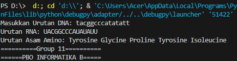

# DNA-Translator
UAS PBO Soal 6
Soal : Terjemahan DNA menggunakan python: Dengan menggunakan rumus python ini, kita dapat menerjemahkan DNA menjadi RNA dan kemudian menjadi protein. Ini membantu untuk mengubah urutan DNA tertentu menjadi protein yang setara.

# Tentang Program
menggunakan program ini, pengguna dapat menginput urutan DNA (contoh: TACGGCCCATATATT) dan program akan menerjemahkan urutan DNA tersebut menjadi sebuah urutan RNA sekaligus urutan asam amino(protein) yang setara. RNA dan protein yang setara tentu saja didapat melalui tabel kodon yang banyak tersedia. Program ini dapat membantu pengguna dalam proses transkripsi DNA ke RNA serta translasi dari RNA ke asam amino secara lebih efektif dan lebih mudah. Program ini juga dapat menerima input berupa huruf non kapital (contoh: tacggcccatatatt) karena program akan secara otomatis mengkonversinya menjadi huruf besar setelah diinputkan. selain itu, sesuai dengan tabel kodon dan translasi RNA ke asam amino, program juga dapat mendeteksi jika ada kodon stop dalam urutan yang dimasukkan pengguna. Jadi, program akan otomatis berhenti melakukan translasi ketika bertemu dengan kodon stop.

# Contoh Luaran

### Contoh Luaran Ketika Terdapat Kodon Stop

.png)
